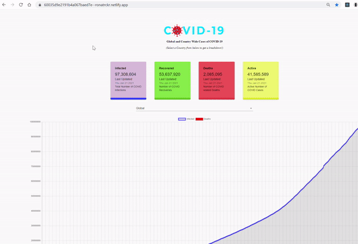

# Tracking Covid-19

Reflecting accurate and daily updated data from John Hopkins University, this single page React application displays Covid-19 related numbers in infections, recoveries, deaths, and active cases worldwide or a user can specify by region(country).This Covid-19 tracking application was built using React as the frontend JavaScript library, Express & Node.js for backend support, and Axios for 3rd-party API requests. The site was deployed with Heroku.

## Technologies
* JavaScript
* React
* Express
* Nodejs
* Mathdroid Covid-19 API(John Hopkins reflected numbers)
* Material-UI/ReactStrap
* React-chartjs

## Features
* Users can filter by region(country).
* Responsive for both desktop and mobile.

## Possible Future plans
* Incorporate real-time data from individual states & counties for US country-picker
* Add route or section of best practices to prevent or treat Covid-19

